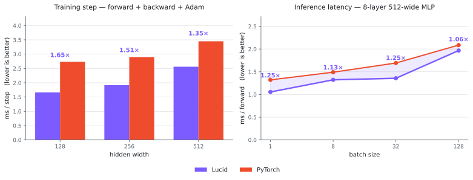

<div align="center">

# Lucid³


<br>


[](https://pepy.tech/projects/lucid-dl)


**[Documentation](https://chanlumerico.github.io/lucid/)** ·
**[Model Zoo](https://chanlumerico.github.io/lucid/)** ·
**[Hugging Face](https://huggingface.co/ChanLumerico/lucid)** ·
**[Changelog](CHANGELOG.md)** ·
**[Contributing](CONTRIBUTING.md)**

</div>

---

Lucid is a deep learning framework for Apple Silicon, written from scratch. It gives you a
familiar Python API on top of a custom C++ engine that talks directly to Apple's hardware
stack — MLX on the GPU, Accelerate on the CPU — with no NumPy anywhere in the compute path.

It started as a framework you could read end to end, and it still is. What changed in 3.0 is
that it also became one you can train with: a rewritten C++ engine, 260+ registered ops,
mixed precision, an op-level profiler, and **hundreds of model implementations**, each one
built from its paper — and one you can ship from, with a native Core ML exporter that puts a
trained model on the **Neural Engine**.

```python
import lucid
import lucid.nn as nn
import lucid.optim as optim

model = nn.Sequential(nn.Linear(784, 256), nn.ReLU(), nn.Linear(256, 10)).to("metal")
opt = optim.Adam(model.parameters(), lr=1e-3)

x = lucid.randn(64, 784, device="metal")
y = lucid.randn(64, 10, device="metal")

for _ in range(200):
    loss = nn.functional.mse_loss(model(x), y)
    loss.eval()                 # flush MLX's lazy graph before backward

    opt.zero_grad()
    loss.backward()
    opt.step()

print(f"loss: {loss.item():.4f}")
```

> **One Apple-Silicon-specific habit.** MLX defers execution until a value is needed, so call
> `.eval()` on the loss before `backward()`. Without it the deferred graph grows unbounded and
> throughput degrades. This is the only place the lazy backend leaks into your training loop.

## 📦 Installation

```bash
pip install lucid-dl              # everything you need to train
pip install lucid-dl[models]      # + safetensors, for pretrained weights
```

GPU support needs no separate step — MLX is linked into the engine at build time.

```python
import lucid

x = lucid.ones((4, 4), device="metal")
print(x.device.type)   # metal
```

From source, the C++ engine builds automatically through scikit-build-core + CMake + Ninja
(Xcode Command Line Tools required):

```bash
git clone https://github.com/ChanLumerico/lucid.git && cd lucid
pip install -e ".[dev]"
```

## ✨ Why Lucid

**It reads like PyTorch.** `Tensor`, `nn.Module`, `optim`, `state_dict` — the surface is
deliberately familiar, so what you already know transfers. Where Lucid diverges from the
reference implementation, the divergence is written down next to the code with the measured
difference, not quietly smoothed over.

**The engine is genuinely standalone.** No compute path imports NumPy. `import lucid`, the
forward and backward passes, the optimizer step, and native `save`/`load` all run without it.
NumPy ships as a dependency purely so `.numpy()`, DLPack, and the DataLoader work out of the
box — a convenience at the boundary, not a load-bearing part of the architecture.

**Two backends, never mixed.** CPU is Apple Accelerate; GPU is MLX. No op crosses between
them — each backend is a complete implementation in its own right.

**It reaches the Neural Engine.** Neither of Lucid's own backends targets the ANE — nothing
outside Core ML does. `lucid.coreml` writes a `.mlpackage` directly, with no conversion
toolchain in the loop, and a ResNet-18 that takes 6.1 ms on Metal takes 0.90 ms there.

**Batteries you actually reach for.** Mixed precision, an op-level profiler, determinism and
memory-accounting switches, and checkpoints that stay readable across releases — all
first-class, none bolted on.

## 🦁 The Model Zoo

Several hundred factories across fifty-odd families, each implemented from its paper rather
than ported. Every factory declares its parameter count, and CI rebuilds each model to check
the declaration against what the code actually constructs — so the numbers on the docs site
are derived, never typed in.

```python
from lucid.models import create_model, list_models

list_models(task="object-detection")             # browse what's registered
model = create_model("resnet_50", num_classes=10)
```

Pretrained weights download on demand, the way you'd expect from torchvision or the Hub — the
`.safetensors` file is fetched, cached, and loaded in one call:

```python
from lucid.models import create_model
from lucid.weights import list_pretrained

list_pretrained("resnet_50_cls")                     # ['IMAGENET1K_V1']
model = create_model("resnet_50_cls", pretrained=True)

# or straight from the family, if you prefer the explicit import
from lucid.models.vision.resnet import resnet_50_cls
model = resnet_50_cls(pretrained=True)
```

Weights live on the task-head factories — `resnet_50` is the backbone, `resnet_50_cls` is the
classifier that has a checkpoint. Asking a backbone for `pretrained=True` tells you which
factory to use instead of quietly handing back random weights. Needs the `[models]` extra.

| Domain | Families |
|---|---|
| Image classification | LeNet, AlexNet, ZFNet, VGG, GoogLeNet, Inception v3, Inception-ResNet, Xception, ResNet, ResNeXt, ResNeSt, SE-ResNet, SK-ResNet, DenseNet, MobileNet v1–v3, EfficientNet, ConvNeXt, CSPNet |
| Vision transformers | ViT, Swin, PVT v2, CvT, CoAtNet, MaxViT, CrossViT, InceptionNeXt, EfficientFormer |
| Detection | YOLO v1–v4, R-CNN, Fast R-CNN, Faster R-CNN, EfficientDet, DETR |
| Segmentation | U-Net, ResU-Net, Attention U-Net, FCN, MaskFormer, Mask2Former, Mask R-CNN |
| Generative | DDPM, NCSN, RealNVP, NICE, VAE, Flow Matching, Rectified Flow, Neural ODE |
| Language | BERT, RoFormer, GPT, GPT-2, Transformer |

## 🏗️ Architecture

| Layer | What lives there |
|---|---|
| **Python API** | `lucid.*` · `lucid.nn.*` · `lucid.optim.*` |
| **Composite layer** | pure-Python ops, op registry, the type boundary |
| **pybind11 boundary** | one auditable crossing point — nothing else may cross |
| **C++ · Tensor** | storage, views, dtype, device |
| **C++ · Autograd** | dynamic graph, reverse-mode backward engine |
| **C++ · Ops** | 260+ kernels across every op family |
| **C++ · CPU backend** | Apple Accelerate — BLAS / LAPACK / vDSP |
| **C++ · GPU backend** | MLX + Metal |
| **C++ · Core ML** | MIL protobuf writer, weight blob, `.mlpackage` bundle, ObjC++ runtime |

Dependencies run strictly downward, and CI validates the layer graph on every commit — a
violation fails the build rather than becoming a convention nobody enforces.

Autograd is reverse-mode over a dynamic graph, with higher-order differentiation available in
`lucid.autograd`. View ops — `reshape`, `permute`, `transpose`, slicing — are metadata-only
and allocate nothing.

## 🧩 Ecosystem

| Package | Surface | What's in it |
|---|---|---|
| `lucid` | 340+ | creation, math, reduction, shape, indexing, dtypes, grad control |
| `lucid.nn` | 170+ modules | linear, conv, recurrent, norm, attention, pooling, dropout, padding, loss |
| `lucid.nn.functional` | 120+ | stateless mirrors of the module API |
| `lucid.optim` | 13 optimizers, 16 schedulers | SGD → LBFGS; `OneCycleLR`, `CosineAnnealingWarmRestarts`, … |
| `lucid.linalg` | 35+ | QR, SVD, Cholesky, Eigh, LU, solvers, `matrix_exp` |
| `lucid.fft` | 20+ | full DFT surface, Hermitian forms, N-D variants |
| `lucid.special` | 35+ | erf, Bessel, gamma, digamma, polygamma, Hurwitz ζ |
| `lucid.distributions` | 30+ dists, 15+ transforms | constraints, KL registry, MC fallback |
| `lucid.einops` | 4 | `rearrange`, `reduce`, `repeat`, `einsum` |
| `lucid.metal` | — | `run_kernel` — write a Metal shader when the op set runs out |
| `lucid.coreml` | 24 | `.mlpackage` export — Neural Engine, weight compression, flexible shapes, state |

### 🔩 Custom Metal kernel

```python
import lucid
from lucid.metal import run_kernel

x = lucid.ones(8, device="metal") * 3.0

y = run_kernel(
    source="""
    #include <metal_stdlib>
    using namespace metal;

    kernel void scale(device const float* x [[buffer(0)]],
                      device float*       y [[buffer(1)]],
                      uint gid [[thread_position_in_grid]]) {
        y[gid] = x[gid] * 2.0f;
    }
    """,
    function_name="scale",
    inputs=[x],
    output_shape=(8,),
    dtype=lucid.float32,
    grid=(8, 1, 1),
    threads=(8, 1, 1),
)
print(y.numpy())   # [6. 6. 6. 6. 6. 6. 6. 6.]
```

`grid` and `threads` both default to `(1, 1, 1)`, so they have to cover your data — leaving
them at the default silently runs a single thread.

### 🎚️ Mixed precision

```python
import lucid
import lucid.nn as nn
import lucid.optim as optim
from lucid.amp import autocast, GradScaler

model = nn.Linear(512, 512).to("metal")
opt = optim.Adam(model.parameters(), lr=1e-3)
scaler = GradScaler()

with autocast():
    loss = model(lucid.randn(32, 512, device="metal")).sum()

scaler.scale(loss).backward()
scaler.step(opt)
scaler.update()
```

### 💾 Checkpoints

```python
lucid.save(model.state_dict(), "checkpoint.lucid")
model.load_state_dict(lucid.load("checkpoint.lucid"))
```

State dicts are an `OrderedDict` with a `_metadata` attribute carrying version information, so
a checkpoint written by one release stays readable by the next.

For anything you intend to publish, write **safetensors** instead — no pickle, so loading a
file you did not produce cannot execute code:

```python
lucid.save_safetensors(model.state_dict(), "model.safetensors")
model.load_state_dict(lucid.load_safetensors("model.safetensors"))
```

Large models can be sharded across several files with `lucid.save_sharded` /
`lucid.load_sharded`.

## 📱 Core ML Export

Neither backend reaches the Neural Engine — nothing outside Core ML does. `lucid.coreml`
writes the `.mlpackage` itself, so no conversion toolchain is in the loop at export time or
in your dependencies.

```python
import lucid, lucid.models as M, lucid.coreml as cml

model = M.create_model("resnet_18").eval()
x = lucid.randn(1, 3, 224, 224)

package = cml.export(model, x, "resnet18.mlpackage",
                     precision=cml.Precision.FLOAT16,     # the ANE runs float16, nothing else
                     compute_units=cml.ComputeUnits.CPU_AND_NE)

package.verify(model, x)              # largest difference against the eager model
package.benchmark(x).median_ms        # 0.90
package.compute_plan()                # where each operation actually landed
```

Batch 1 at 224², float16, M1 Pro — median of five measurements. "Metal" is Lucid's own MLX
path with the lazy graph flushed, which is the honest comparison; against the CPU the same
numbers read 12–53×.

| Model | Metal | Neural Engine | |
|---|---|---|---|
| `alexnet` | 2.2 ms | **0.42 ms** | 5.3× |
| `resnet_18` | 6.1 ms | **0.90 ms** | 6.7× |
| `mobilenet_v2` | 7.9 ms | **0.61 ms** | 13.1× |
| `convnext_tiny` | 10.5 ms | **2.87 ms** | 3.7× |

**58 of 62 zoo families export.** Beyond precision and compute units, `export` takes weight
compression (`INT8`, `Palettize(bits=…)`, `Sparsify(ratio=…)`), image inputs and classifier
outputs, flexible shapes, values carried between predictions, and several entry points
sharing one set of weights. `CompressionAware` fine-tunes a model against the compression it
will ship with, which is what makes palettization below six bits usable at all.

Silently wrong is this area's default failure — a package missing a layer still loads and
still answers — so the refusals are the load-bearing part. An unmapped operation is refused
**by name**; a comparison against a near-zero reference is refused rather than reported as a
flawless match; a failed export leaves the package already deployed at that path untouched;
and a model that samples inside `forward` is refused unless the draw is lifted to an input
(`draws=cml.Draws.AS_INPUT`), because Core ML folds it at build time and the package would
otherwise return one fixed sample for the life of the file.

## ⚡ Performance

<div align="center">
<picture>
  <source media="(prefers-color-scheme: dark)" srcset="docs/assets/benchmark-dark.svg">
  
</picture>
</div>

Both panels are GPU-resident, measured on an **M1 Pro / 16 GB, macOS 26**: median of 40 runs
after 8 warm-up iterations, each framework synchronised before the clock stops — MLX's lazy
graph flushed on one side, the device synchronise on the other. Left is a full training step
(forward, backward, Adam update) at batch 128; right is forward-only latency under no-grad.

**These are the shapes Lucid is good at, and only those.** Small-to-mid layers are where
per-op dispatch is a real share of the step and the short path from Python to the engine pays
off. It does not generalise: width 1024 swung between 0.95× and 1.23× across repeats, so it is
left out rather than reported as a win, and by 2048 the reference framework is ahead — past
that point both are waiting on the same Metal kernels and dispatch is no longer what you are
measuring.

Every point above held inside a narrow band over five independent repeats. Reproduce it, or
watch the crossover, with:

```bash
python -m lucid.test.perf.bench_readme_figure           # the numbers above
python -m lucid.test.perf.bench_readme_figure --sweep   # out to width 4096
```

`FusedLinear` folds Linear + ReLU/GELU into one kernel at inference and falls back to standard
autograd during training, with no branch in your code.

## 💻 Requirements

| | Minimum |
|---|---|
| Hardware | Apple Silicon (M1 or later) |
| OS | macOS 26 Tahoe |
| Python | 3.14 only — the type annotations rely on PEP 649 lazy evaluation |
| MLX | ≥ 0.31 (`macosx_26_0_arm64` wheel + `mlx-metal` split) |
| Build | CMake ≥ 3.24, Ninja ≥ 1.11, Xcode CLT |

Linux, Windows, x86-64, and macOS ≤ 15 are not supported, and are not planned.

## 🧠 Design Notes

**No NumPy in the compute path.** A clean import graph, faster cold start, and the option to
embed Lucid where NumPy is unavailable. It appears only at the explicit bridge boundaries —
`.numpy()`, DLPack, checkpoint serialisation, data ingest — and nowhere else.

**Ops carry versions.** Each registration includes a version number, so loading an older
checkpoint can trigger migration instead of silently computing something different.

## 🤝 Contributing

[CONTRIBUTING.md](CONTRIBUTING.md) covers the coding conventions, the workflow for adding an
op, and the PR checklist.

## 📜 License

See [LICENSE](LICENSE).

<div align="center">

<br>

**Inspired by**


</div>
