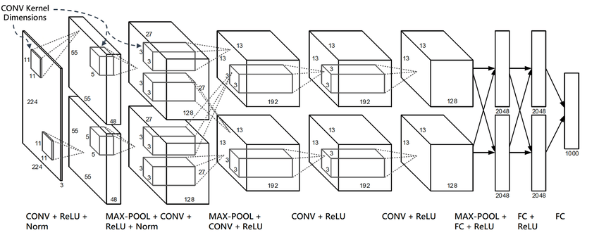

AlexNet
=======

.. toctree::
    :maxdepth: 1
    :hidden:

    alexnet.rst

.. raw:: html

   
     ConvNet
   

   
     Image Classification
   

.. autoclass:: lucid.models.AlexNet

The `AlexNet` module in `lucid.nn` implements the AlexNet architecture, 
a convolutional neural network designed for image classification tasks. 
It consists of multiple convolutional and fully connected layers with ReLU 
activations and dropout for regularization.

Class Signature
---------------

.. code-block:: python

    class AlexNet(nn.Module):
        def __init__(self, num_classes: int = 1000)

Parameters
----------

- **num_classes** (*int*, optional):
  The number of output classes for classification. Default is 1000.

Attributes
----------

- **features** (*nn.Sequential*):
  The convolutional layers, including pooling and ReLU activations.

- **avgpool** (*nn.AdaptiveAvgPool2d*):
  Adaptive average pooling layer that reduces the spatial dimensions to (6, 6).

- **classifier** (*nn.Sequential*):
  The fully connected layers with dropout and ReLU activations for classification.

Architecture
------------

The architecture of AlexNet is as follows:

1. **Convolutional Layers**:
   - 5 convolutional layers with ReLU activations.
   - MaxPooling after the 1st, 2nd, and 5th convolutional layers.

2. **Fully Connected Layers**:
   - 2 hidden fully connected layers, each with 4096 units and ReLU activations.
   - Output layer with `num_classes` units for classification.

3. **Regularization**:
   - Dropout is applied to fully connected layers to reduce overfitting.

Examples
--------

**Basic Example**

.. code-block:: python

    import lucid.nn as nn

    # Create AlexNet with default 1000 classes
    model = nn.AlexNet(num_classes=1000)

    # Input tensor with shape (1, 3, 224, 224)
    input_ = Tensor.randn(1, 3, 224, 224)

    # Perform forward pass
    output = model(input_)

    print(output.shape)  # Shape: (1, 1000)

**Explanation**

The model processes the input through its convolutional and fully connected layers, 
producing logits for 1000 classes.

**Custom Number of Classes**

.. code-block:: python

    # Create AlexNet with custom 10 classes
    model = nn.AlexNet(num_classes=10)

    input_ = Tensor.randn(1, 3, 224, 224)

    output = model(input_)
    print(output.shape)  # Shape: (1, 10)
