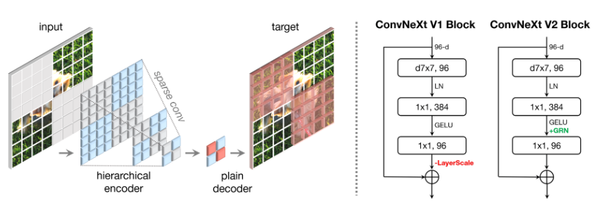

ConvNeXt_V2
===========

.. toctree::
    :maxdepth: 1
    :hidden:

    convnext_v2_atto.rst
    convnext_v2_femto.rst
    convnext_v2_pico.rst
    convnext_v2_nano.rst
    convnext_v2_tiny.rst
    convnext_v2_base.rst
    convnext_v2_large.rst
    convnext_v2_huge.rst

.. autoclass:: lucid.models.ConvNeXt_V2

The `ConvNeXt_V2` module in `lucid.nn` builds upon the original ConvNeXt architecture, 
offering enhanced flexibility and efficiency. It introduces updated configurations for 
modern image classification tasks, while maintaining the hierarchical design of 
its predecessor.

Class Signature
---------------

.. code-block:: python

    class ConvNeXt_V2(ConvNeXt):
        def __init__(
            num_classes: int = 1000,
            depths: list[int] = [3, 3, 9, 3],
            dims: list[int] = [96, 192, 384, 768],
            drop_path: float = 0.0,
        )

Parameters
----------

- **num_classes** (*int*, optional):
  The number of output classes for classification. Default is 1000.

- **depths** (*list[int]*, optional):
  The number of layers in each stage of the network. Default is [3, 3, 9, 3].

- **dims** (*list[int]*, optional):
  The number of channels in each stage of the network. Default is [96, 192, 384, 768].

- **drop_path** (*float*, optional):
  The stochastic depth drop path rate. Default is 0.0.

Examples
--------

**Basic Example**

.. code-block:: python

    import lucid.models as models

    # Create ConvNeXt_V2 with default 1000 classes
    model = models.ConvNeXt_V2(num_classes=1000)

    # Input tensor with shape (1, 3, 224, 224)
    input_ = lucid.random.randn(1, 3, 224, 224)

    # Perform forward pass
    output = model(input_)
    print(output.shape)  # Shape: (1, 1000)
