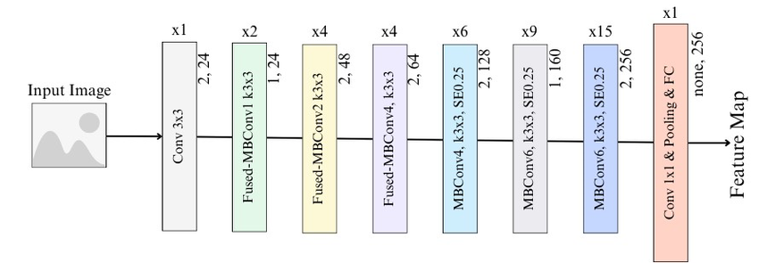

EfficientNet_V2
===============

.. toctree::
    :maxdepth: 1
    :hidden:

    efficientnet_v2_s.rst
    efficientnet_v2_m.rst
    efficientnet_v2_l.rst
    efficientnet_v2_xl.rst

|convnet-badge| |imgclf-badge|

.. autoclass:: lucid.models.EfficientNet_V2

`EfficientNet_V2` builds on the EfficientNet architecture, which employs a compound scaling method to balance
depth, width, and resolution for optimal performance. The V2 variant introduces further improvements
such as training with larger batch sizes, using higher-resolution images, and advanced regularization techniques
like stochastic depth and progressive learning.

Class Signature
---------------

.. code-block:: python

    class EfficientNet_V2(nn.Module):
        def __init__(
            self,
            block_cfg: list,
            num_classes: int = 1000,
            dropout: float = 0.2,
            drop_path_rate: float = 0.2,
        ) -> None

Parameters
----------

- **block_cfg** (*list*):
  A list defining the structure and parameters of the building blocks in the network. 
  Each entry specifies the configuration of a block, such as number of filters, stride, etc.

- **num_classes** (*int*, optional):
  The number of output classes for classification. Default is 1000.

- **dropout** (*float*, optional):
  The dropout rate applied to the final fully connected layer. Default is 0.2.

- **drop_path_rate** (*float*, optional):
  The rate for stochastic depth regularization. Default is 0.2.

.. warning::

   Ensure the `block_cfg` is well-defined to avoid shape mismatches or runtime errors
   during the forward pass.
