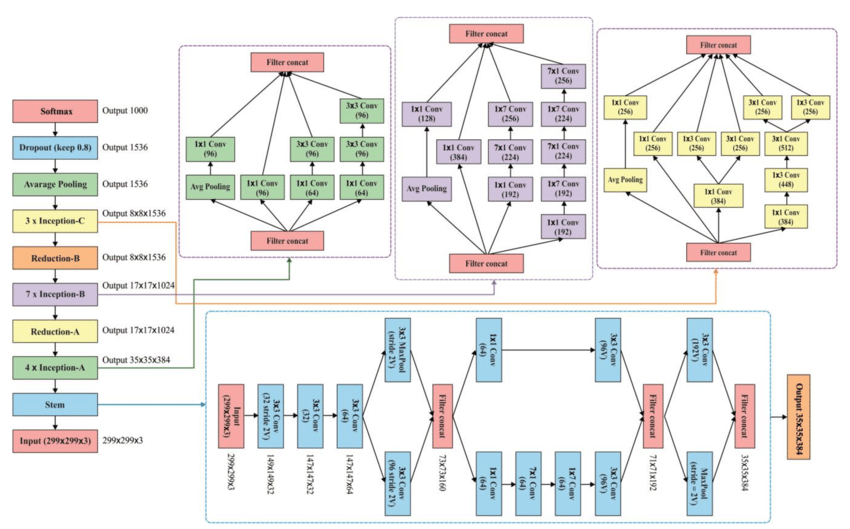

Inception
=========

.. toctree::
    :maxdepth: 1
    :hidden:

    inception_v1.rst
    inception_v3.rst
    inception_v4.rst

.. autoclass:: lucid.models.Inception

Overview
--------

The `Inception` base class provides a flexible implementation for defining 
various versions of the Inception architecture, including Inception v1, v3, and v4. 

It facilitates the configuration of the feature extraction and classification components 
through arguments, making it adaptable for different versions of the Inception series.

Class Signature
---------------

.. code-block:: python

   class Inception(nn.Module):
       def __init__(self, num_classes: int, use_aux: bool = True) -> None

Parameters
----------

- **num_classes** (*int*)
  The number of output classes for the final classification layer.

- **use_aux** (*bool*, optional)
  Whether to include auxiliary classifiers. Auxiliary classifiers are 
  additional branches used during training to assist optimization. Default is `True`.
