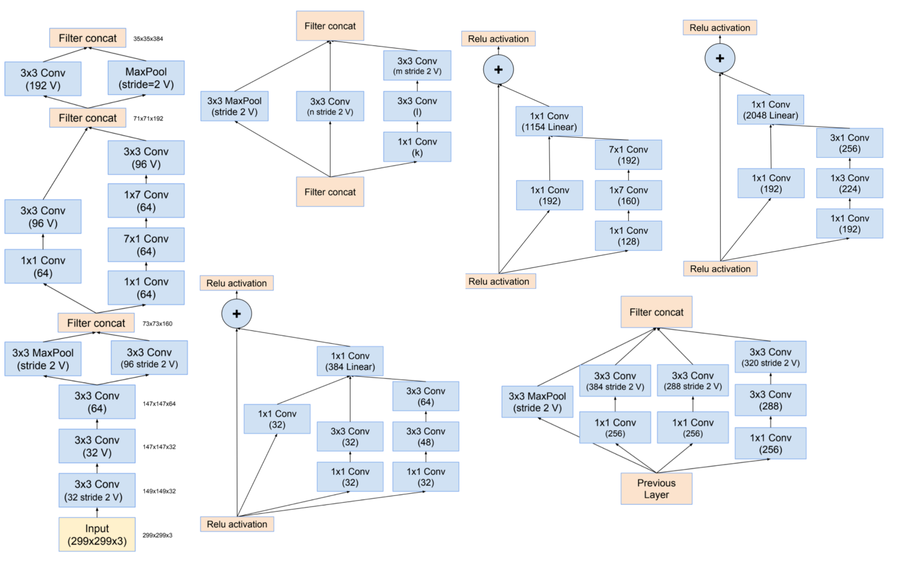

InceptionResNet
===============

.. toctree::
    :maxdepth: 1
    :hidden:

    inception_resnet_v1.rst
    inception_resnet_v2.rst

.. raw:: html

   
     ConvNet
   

   
     Image Classification
   

.. autoclass:: lucid.models.InceptionResNet

Overview
--------

The `InceptionResNet` base class defines a flexible architecture that combines
Inception-style modules with residual connections. This approach improves optimization
and gradient flow in deep neural networks, making it suitable for a variety of image
classification tasks.

This class serves as a foundation for specific versions like Inception-ResNet v1 and v2
by providing essential components such as a stem network, convolutional layers, and
fully connected layers.

Class Signature
---------------

.. code-block:: python

   class InceptionResNet(nn.Module):
       def __init__(self, num_classes: int) -> None

Parameters
----------

- **num_classes** (*int*):
  The number of output classes for the final classification layer.

Attributes
----------

- **stem** (*nn.Module*):
  The initial stem module that extracts low-level features from the input.

- **conv** (*nn.Sequential*):
  A sequential container for the main convolutional and residual blocks.

- **fc** (*nn.Sequential*):
  A sequential container for the fully connected layers that perform classification.

Methods
-------

- **forward(x: Tensor) -> Tensor**
  Performs the forward pass through the stem, convolutional blocks, 
  and fully connected layers.

  .. code-block:: python

      def forward(self, x):
          x = self.stem(x)
          x = self.conv(x)
          x = x.view(x.shape[0], -1)  # Flatten
          x = self.fc(x)
          return x
