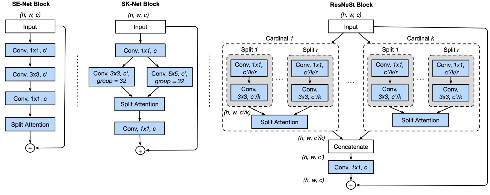

ResNeSt
=======

.. toctree::
    :maxdepth: 1
    :hidden:

    resnest_14.rst
    resnest_26.rst
    resnest_50.rst
    resnest_101.rst
    resnest_200.rst
    resnest_269.rst
    resnest_50_4s2x40d.rst
    resnest_50_1s4x24d.rst

|convnet-badge| |imgclf-badge|

.. autoclass:: lucid.models.ResNeSt

The `ResNeSt` class extends the ResNet architecture by integrating Split-Attention blocks,
providing improved representational power for a variety of vision tasks.

Class Signature
---------------

.. code-block:: python

    class ResNeSt(ResNet):
        def __init__(
            self,
            block,
            layers,
            num_classes=1000,
            base_width: int = 64,
            stem_width: int = 32,
            cardinality: int = 1,
            radix: int = 2,
            avd: bool = True,
        ) -> None

Parameters
----------
- **block** (*type*):
  The block class to be used in constructing the network (e.g., `_ResNeStBottleneck`).

- **layers** (*list[int]*):
  A list specifying the number of blocks at each stage of the network.

- **num_classes** (*int*, optional):
  Number of output classes for the classification task. Defaults to 1000.

- **base_width** (*int*, optional):
  Base width of the network for scaling the number of channels. Defaults to 64.

- **stem_width** (*int*, optional):
  Width of the initial stem convolution. Defaults to 32.

- **cardinality** (*int*, optional):
  Number of groups for grouped convolutions. Defaults to 1.

- **radix** (*int*, optional):
  Number of splits for the Split-Attention block. Defaults to 2.

- **avd** (*bool*, optional):
  Whether to use Adaptive Average Pooling for downsampling. Defaults to True.

Examples
--------

.. code-block:: python

    from lucid.models import ResNeSt

    # Define a ResNeSt model with 50 layers
    model = ResNeSt(
        block=_ResNeStBottleneck,
        layers=[3, 4, 6, 3],  # ResNet-50 configuration
        num_classes=1000,
        base_width=64,
        stem_width=32,
        cardinality=1,
        radix=2,
        avd=True
    )

    # Forward pass with a sample input
    input_tensor = lucid.random.randn(1, 3, 224, 224)
    output = model(input_tensor)
    print(output.shape)  # Output: (1, 1000)

.. note::

    The `ResNeSt` class enables flexibility in defining variants of ResNeSt models 
    (e.g., ResNeSt-50, ResNeSt-101, etc.) by customizing parameters such as `layers` 
    and `block`.