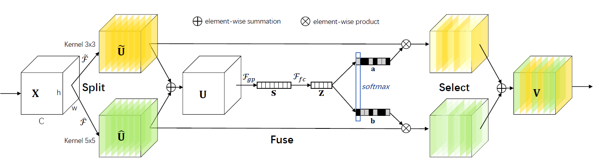

SKNet
=====

.. toctree::
    :maxdepth: 1
    :hidden:

    sk_resnet_18.rst
    sk_resnet_34.rst
    sk_resnet_50.rst
    
    sk_resnext_50_32x4d.rst

.. raw:: html

   
     ConvNet
   

   
     Image Classification
   

.. autoclass:: lucid.models.SKNet

The `SKNet` class extends the `ResNet` architecture by incorporating Selective Kernel (SK) blocks,
which dynamically adjust receptive fields via attention mechanisms. This enables the network to
adaptively fuse multi-scale features, improving performance on tasks involving objects of varying scales.

Class Signature
---------------

.. code-block:: python

    class lucid.nn.SKNet(
        block: nn.Module,
        layers: list[int],
        num_classes: int = 1000,
        kernel_sizes: list[int] = [3, 5],
        base_width: int = 64,
        cardinality: int = 1,
    )

Parameters
----------
- **block** (*nn.Module*):
  The building block module used for the SKNet layers. Typically an SKBlock or compatible 
  block type.

- **layers** (*list[int]*):
  Specifies the number of blocks in each stage of the network.

- **num_classes** (*int*, optional):
  Number of output classes for the final fully connected layer. Default: 1000.

- **kernel_sizes** (*list[int]*, optional):
  Specifies the sizes of kernels to be used in the SK blocks for multi-scale processing. 
  Default: [3, 5].

- **base_width** (*int*, optional):
  Base width of the feature maps in the SK blocks. Default: 64.

- **cardinality** (*int*, optional):
  The number of parallel convolutional groups (grouped convolutions) in the SK blocks. 
  Default: 1.

Attributes
----------
- **kernel_sizes** (*list[int]*):
  Stores the kernel sizes used in the SK blocks.

- **base_width** (*int*):
  Stores the base width of feature maps.

- **cardinality** (*int*):
  Stores the number of groups for grouped convolutions.

- **layers** (*list[nn.Module]*):
  A list of stages, each containing a sequence of SK blocks.

Forward Calculation
--------------------
The forward pass of the `SKNet` model includes:

1. **Stem**: Initial convolutional layers for feature extraction.
2. **Selective Kernel Stages**: Each stage applies a series of SK blocks configured via `layers`.
3. **Global Pooling**: A global average pooling layer reduces spatial dimensions.
4. **Classifier**: A fully connected layer maps the features to class scores.

.. math::

    \text{output} = \text{FC}(\text{GAP}(\text{SKBlocks}(\text{Stem}(\text{input}))))

.. note::

   - The `SKNet` is well-suited for tasks requiring multi-scale feature representation.
   - Increasing the `kernel_sizes` parameter allows the model to capture features over 
     larger receptive fields.
