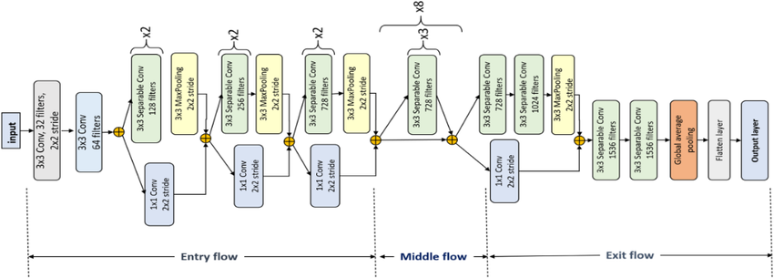

Xception
========

.. toctree::
    :maxdepth: 1
    :hidden:

    xception.rst

|convnet-badge| |imgclf-badge|

.. autoclass:: lucid.models.Xception

The `Xception` class implements the base Xception architecture, 
leveraging depthwise separable convolutions for efficient and scalable feature extraction. 
This model is designed for classification tasks and provides flexibility 
for the number of output classes.

Class Signature
---------------

.. code-block:: python

    class lucid.models.Xception(num_classes: int = 1000) -> None

Parameters
----------

- **num_classes** (*int*, optional):
  The number of output classes for classification. Default is 1000.

Attributes
----------

- **features** (*Module*):
  The sequential feature extractor composed of depthwise separable convolutions.

- **classifier** (*Module*):
  The fully connected classification head.

Forward Pass
------------

The forward method applies the feature extractor to the input tensor, 
followed by the classifier for prediction. 

The overall structure can be summarized as:

.. math::

    \mathbf{y} = \text{classifier}(\text{features}(\mathbf{x}))

Where:
- :math:`\mathbf{x}` is the input tensor.
- :math:`\text{features}` is the feature extraction module.
- :math:`\text{classifier}` is the fully connected head.
- :math:`\mathbf{y}` is the output tensor.

Examples
--------

**Basic Usage:**

.. code-block:: python

    >>> import lucid.models as models
    >>> model = models.Xception(num_classes=1000)
    >>> input_tensor = lucid.random.randn(1, 3, 299, 299)  # Example input with shape (batch_size, channels, height, width)
    >>> output = model(input_tensor)
    >>> print(output.shape)
    (1, 1000)

**Modifying Output Classes:**

.. code-block:: python

    >>> model = models.Xception(num_classes=1000)
    >>> print(model)
    ...
