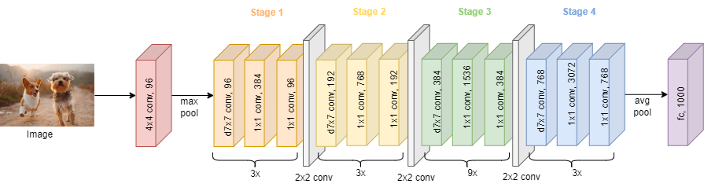

ConvNeXt
========

.. toctree::
    :maxdepth: 1
    :hidden:

    convnext_tiny.rst
    convnext_small.rst
    convnext_base.rst
    convnext_large.rst
    convnext_xlarge.rst

|convnet-badge| |imgclf-badge|

.. autoclass:: lucid.models.ConvNeXt

The `ConvNeXt` module in `lucid.nn` implements the ConvNeXt architecture, 
a modernized version of convolutional neural networks inspired by transformer architectures. 
It features hierarchical design, depthwise convolutions, and improved training techniques, 
optimized for image classification tasks.

Class Signature
---------------

.. code-block:: python

    class ConvNeXt(nn.Module):
        def __init__(
            num_classes: int = 1000,
            depths: list[int] = [3, 3, 9, 3],
            dims: list[int] = [96, 192, 384, 768],
            drop_path: float = 0.0,
            layer_scale_init: float = 1e-6
        )

Parameters
----------

- **num_classes** (*int*, optional):
  The number of output classes for classification. Default is 1000.

- **depths** (*list[int]*, optional):
  The number of layers in each stage of the network. Default is [3, 3, 9, 3].

- **dims** (*list[int]*, optional):
  The number of channels in each stage of the network. Default is [96, 192, 384, 768].

- **drop_path** (*float*, optional):
  The stochastic depth drop path rate. Default is 0.0.

- **layer_scale_init** (*float*, optional):
  The initial value for layer scale. Default is 1e-6.

Architecture
------------

The architecture of ConvNeXt is as follows:

1. **Hierarchical Stages**:
   - 4 stages with varying depths and dimensions, defined by the `depths` and `dims` parameters.
   - Each stage includes depthwise convolutions, normalization, and activation layers.

2. **Normalization**:
   - Layer normalization applied across the stages.

3. **Drop Path**:
   - Stochastic depth used for regularization, controlled by `drop_path`.

4. **Classification Head**:
   - A fully connected head for final classification, with `num_classes` outputs.

Examples
--------

**Basic Example**

.. code-block:: python

    import lucid.models as models

    # Create ConvNeXt with default 1000 classes
    model = models.ConvNeXt(num_classes=1000)

    # Input tensor with shape (1, 3, 224, 224)
    input_ = lucid.random.randn(1, 3, 224, 224)

    # Perform forward pass
    output = model(input_)

    print(output.shape)  # Shape: (1, 1000)

**Explanation**

The model processes the input through hierarchical convolutional stages 
and outputs logits for 1000 classes.

**Custom Configuration**

.. code-block:: python

    # Create ConvNeXt with custom number of classes and configuration
    model = models.ConvNeXt(
        num_classes=10,
        depths=[2, 2, 6, 2],
        dims=[64, 128, 256, 512],
        drop_path=0.1,
        layer_scale_init=1e-5
    )

    input_ = lucid.random.randn(1, 3, 224, 224)

    output = model(input_)
    print(output.shape)  # Shape: (1, 10)
