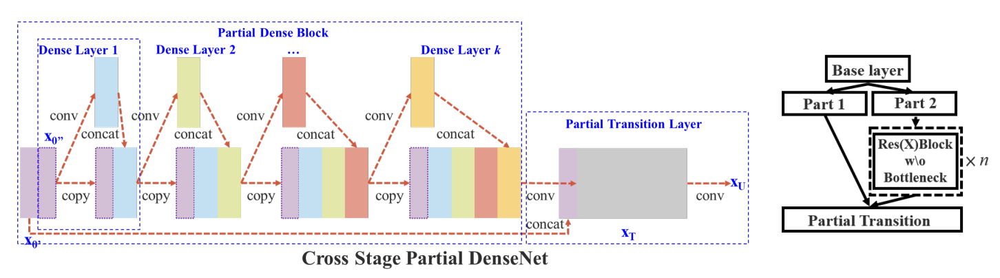

CSPNet
======

.. toctree::
    :maxdepth: 1
    :hidden:

    csp_resnet_50.rst
    csp_resnext_50_32x4d.rst
    csp_darknet_53.rst

|convnet-badge| |imgclf-badge|

.. autoclass:: lucid.models.CSPNet

CSPNet was originally introduced to mitigate gradient duplication, reduce computation, 
and enhance learning capability by **splitting feature maps**, sending only part of 
them through heavy transformations, and then merging the results. This concept is 
applicable to many backbone families such as ResNet, ResNeXt, DenseNet, and Darknet.

Unlike traditional architectures that send all features through all residual blocks, 
CSPNet **divides the input along the channel axis**, processes part of it through a 
sequence of residual blocks, and then **merges** it with the untouched part. 
This enables **gradient flow from both shallow and deep layers**, while reducing redundant 
computation.

This implementation allows flexible injection of various backbone block types 
(e.g., `ResNetBottleneck`, `DarknetBottleneck`, etc.) into the CSP structure, 
making it suitable for building CSPResNet, CSPDarknet, CSPResNeXt, and more.

Class Signature
---------------

.. code-block:: python

    class CSPNet(nn.Module):
        def __init__(
            self,
            in_channels: int = 3,
            stem_channels: int = 64,
            stage_defs: list[tuple[int, int, Callable, bool]] | None = None,
            num_classes: int = 1000,
            norm: type[nn.Module] = nn.BatchNorm2d,
            act: type[nn.Module] = nn.ReLU,
            split_ratio: float = 0.5,
            global_pool: Literal["avg", "max"] = "avg",
            dropout: float = 0.0,
            feature_channels: int | None = None,
            pre_kernel_size: int = 1,
        ) -> None

Parameters
----------

- **in_channels** (*int*, default=3):  
  Number of input channels, e.g., 3 for RGB input.

- **stem_channels** (*int*, default=64):  
  Number of channels output from the stem convolution layer.

- **stage_defs** (*list of tuple*, optional):  
  Defines the CSP stages as a list of `(num_blocks, out_channels, block_fn, downsample)` 
  tuples. Each stage applies the CSP mechanism using the given block.

- **num_classes** (*int*, default=1000):  
  Output size of the classification head.

- **norm** (*type[nn.Module]*, default=nn.BatchNorm2d):  
  Normalization function to use in convolutional blocks.

- **act** (*type[nn.Module]*, default=nn.ReLU):  
  Activation function used across the network.

- **split_ratio** (*float*, default=0.5):  
  Ratio of the channels to send into the residual (transformation) path versus 
  the shortcut path. A typical value is 0.5.

- **global_pool** (*Literal["avg", "max"]*, default="avg"):  
  Type of global pooling to apply before the classifier head.

- **dropout** (*float*, default=0.0):  
  Dropout probability after global pooling.

- **feature_channels** (*int or None*, optional):  
  The number of output channels before the final linear classifier.  
  If `None`, uses the number of channels from the last stage.

- **pre_kernel_size** (*int*, default=1):  
  Kernel size of the pre-stage convolution (1 for ResNet-style, 
  3 for Darknet-style downsampling).

Key Characteristics
-------------------

**CSPNet is defined by its unique three-part structure:**

1. **Split**:  
   The input feature map is divided along the channel dimension into two parts.

2. **Transform (Part 2)**:  
   One part passes through multiple residual blocks (e.g., ResNet or Darknet style).

3. **Merge**:  
   The output of the transformation is concatenated with the untouched part, 
   followed by a 1x1 convolution.

This leads to:

- Better **gradient diversity** and **optimization stability**.
- Lower parameter count while preserving accuracy.
- Broad applicability to multiple backbone families.

Use Cases
~~~~~~~~~

- Image classification (e.g., ImageNet-scale tasks)
- As a backbone in detection pipelines (e.g., YOLOv4, YOLOX)
- Lightweight models requiring improved efficiency

Examples
--------

.. code-block:: python

    from lucid.models import CSPNet

    model = CSPNet(
        in_channels=3,
        stem_channels=64,
        stage_defs=[
            (3, 256, ResNetBottleneck, True),  # Custom ResNet bottleneck module
            (4, 512, ResNetBottleneck, True),
            (6, 1024, ResNetBottleneck, True),
            (3, 2048, ResNetBottleneck, True),
        ],
        num_classes=1000,
        split_ratio=0.5
    )
