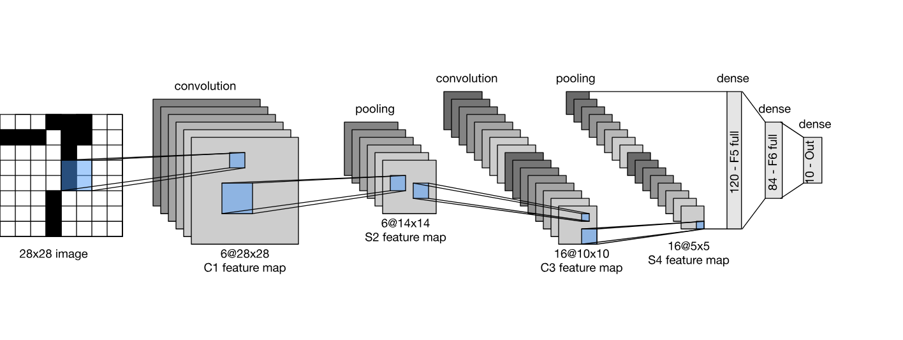

LeNet
=====

.. toctree::
    :maxdepth: 1
    :hidden:

    lenet_1.rst
    lenet_4.rst
    lenet_5.rst

|convnet-badge| |imgclf-badge|

.. autoclass:: lucid.models.LeNet

Overview
--------

The `LeNet` base class provides a flexible implementation for defining 
various versions of the LeNet architecture, including LeNet-1, LeNet-4, and LeNet-5. 

It allows the configuration of convolutional and fully connected layers through arguments, 
making it adaptable for different use cases.

Class Signature
---------------

.. code-block:: python

   class LeNet(nn.Module):
       def __init__(
           self, 
           conv_layers: list[dict], 
           clf_layers: list[int], 
           clf_in_features: int,
        ) -> None

Parameters
----------

- **conv_layers** (*list[dict]*)
  A list of dictionaries specifying the configuration of the convolutional layers. 
  Each dictionary should define the number of output channels (`out_channels`) and optionally other parameters such as kernel size, stride, and padding.

- **clf_layers** (*list[int]*)
  A list specifying the sizes of fully connected (classifier) layers. 
  Each entry represents the number of units in the respective layer.

- **clf_in_features** (*int*)
  The number of input features for the first fully connected layer. 
  This is determined by the output size of the feature extractor.

Attributes
----------

- **feature_extractor** (*nn.Sequential*)
  A sequential model containing the convolutional and pooling layers.

- **classifier** (*nn.Sequential*)
  A sequential model containing the fully connected layers.

Methods
-------

- **forward(x: Tensor) -> Tensor**
  Performs the forward pass through the feature extractor and classifier.

  .. code-block:: python

      def forward(self, x):
          x = self.feature_extractor(x)
          x = x.view(x.shape[0], -1)  # Flatten
          x = self.classifier(x)
          return x

Example Usage
-------------

Below is an example of defining and using a LeNet-based architecture:

.. code-block:: python

   import lucid.models as models

   # Define a custom LeNet architecture
   custom_lenet = models.LeNet(
       conv_layers=[
           {"out_channels": 6},
           {"out_channels": 16},
       ],
       clf_layers=[120, 84, 10],
       clf_in_features=16 * 5 * 5,
   )

   # Sample input tensor (e.g., 32x32 grayscale image)
   input_tensor = lucid.Tensor([...])

   # Forward pass
   output = custom_lenet(input_tensor)
   print(output)
