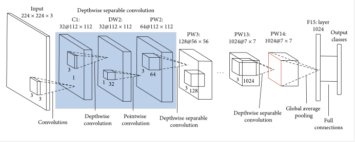

MobileNet
=========

.. toctree::
    :maxdepth: 1
    :hidden:

    mobilenet.rst

|convnet-badge| |imgclf-badge|

.. autoclass:: lucid.models.MobileNet

Overview
--------

The `MobileNet` class implements the MobileNet-v1 architecture, 
which introduces depthwise separable convolutions to reduce computational 
cost while maintaining accuracy. This architecture is ideal for mobile and 
embedded vision applications.

Class Signature
---------------

.. code-block:: python

    class MobileNet(nn.Module):
        def __init__(self, width_multiplier: float, num_classes: int = 1000) -> None

Parameters
----------
- **width_multiplier** (*float*):
  Adjusts the width of the network by scaling the number of channels in each layer. 
  A higher value increases the capacity of the model, while a lower value reduces computational cost.

- **num_classes** (*int*, optional):
  Number of output classes for the classification task. Default is 1000, 
  commonly used for ImageNet.

.. tip::

  - Adjust the `width_multiplier` and `num_classes` parameters to suit specific 
    datasets or computational constraints.
