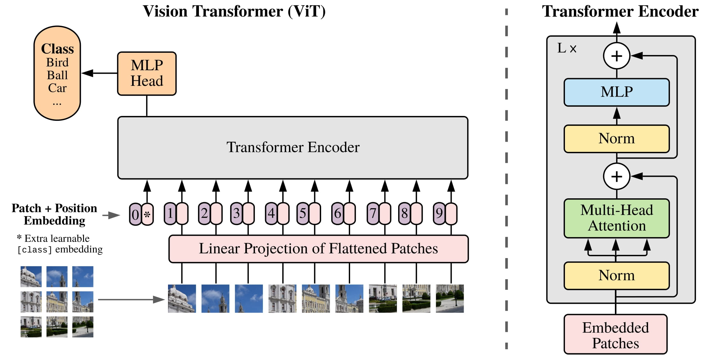

ViT
===

.. toctree::
    :maxdepth: 1
    :hidden:

    vit_tiny.rst
    vit_small.rst
    vit_base.rst
    vit_large.rst
    vit_huge.rst

|transformer-badge| |vision-transformer-badge| |imgclf-badge|

.. autoclass:: lucid.models.ViT

The `ViT` class provides a full implementation of the Vision Transformer model,
including patch embedding, positional encoding, and the final classification head.

Class Signature
---------------

.. code-block:: python

    class ViT(
        img_size: int,
        patch_size: int,
        num_classes: int,
        d_model: int,
        num_heads: int,
        num_layers: int,
        mlp_dim: int,
        dropout: float = 0.1,
    )

Parameters
----------
- **img_size** (*int*):
  Size of the input image (assumes square images).

- **patch_size** (*int*):
  Size of the patches the image is divided into.

- **num_classes** (*int*):
  Number of output classes for classification.

- **d_model** (*int*):
  Dimension of the model’s hidden representations.

- **num_heads** (*int*):
  Number of attention heads in the multi-head self-attention mechanism.

- **num_layers** (*int*):
  Number of Transformer encoder layers.

- **mlp_dim** (*int*):
  Dimension of the feedforward network within each Transformer block.

- **dropout** (*float*, optional):
  Dropout probability applied throughout the model. Default is 0.1.

Examples
--------

.. code-block:: python

    >>> import lucid.models as models
    >>> vit = models.ViT(
    ...     img_size=224,
    ...     patch_size=16,
    ...     num_classes=1000,
    ...     d_model=768,
    ...     num_heads=12,
    ...     num_layers=12,
    ...     mlp_dim=3072,
    ...     dropout=0.1
    ... )
    >>> print(vit)
    ViT(img_size=224, patch_size=16, num_classes=1000, d_model=768, ...)
