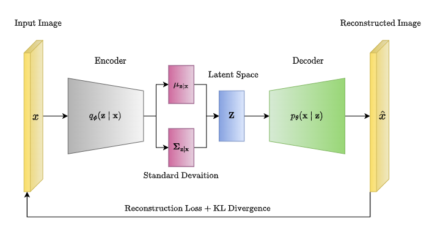

VAE
===
|autoencoder-badge| |vae-badge| |imggen-badge|

.. autoclass:: lucid.models.imggen.VAE

The `VAE` class implements a generalized Variational Autoencoder supporting 
standard and hierarchical variants. It is compatible with various encoder-decoder 
architectures and prior configurations.

This model is modular, allowing users to define multiple layers of latent variables 
and optionally plug in learnable prior modules for deep hierarchies. It is designed 
to support :math:`\beta`-scheduling and flexible loss configurations.

Class Signature
---------------

.. code-block:: python

    class VAE(
        encoders: list[nn.Module],
        decoders: list[nn.Module],
        priors: list[nn.Module] | None = None,
        reconstruction_loss: Literal["mse", "bce"] = "mse",
        kl_weight: float = 1.0,
        beta_schedule: Callable[[int], float] | None = None,
        hierarchical_kl: bool = True,
        depth: int | None = None,
    )

Parameters
----------

- **encoders** (*list[nn.Module]*):  
  A list of encoder modules. Each encoder should output a tensor of shape 
  `(N, 2 * D)` where the first half encodes the mean and the second half the 
  log-variance of the Gaussian latent variable.

- **decoders** (*list[nn.Module]*):  
  A list of decoder modules. Decoding starts from the deepest latent and 
  reconstructs to the original data space.

- **priors** (*list[nn.Module] | None*):  
  Optional list of prior modules that map the latent from the next layer into 
  a prior distribution (output shape must be `(N, 2 * D)`).

- **reconstruction_loss** (*Literal["mse", "bce"]*):  
  Type of reconstruction loss to apply. Either Mean Squared Error (MSE) or 
  Binary Cross Entropy (BCE).

- **kl_weight** (*float*):  
  The default :math:`\beta` weighting applied to KL divergence.

- **beta_schedule** (*Callable[[int], float] | None*):  
  Optional function that outputs :math:`\beta` for each training step.

- **hierarchical_kl** (*bool*):  
  If True, distributes KL loss over all latent layers; otherwise applies :math:`\beta` 
  to each layer equally.

- **depth** (*int | None*):  
  Optionally set the number of latent layers manually. If not provided, 
  it defaults to the number of encoders.

Returns
-------

Use the `forward` method to obtain outputs:

.. code-block:: python

    recon, mus, logvars, zs = model(x)

- **recon** (*Tensor*): Reconstructed tensor in original input shape.
- **mus** (*list[Tensor]*): Means for each latent layer.
- **logvars** (*list[Tensor]*): Log-variances for each latent layer.
- **zs** (*list[Tensor]*): Sampled latent vectors after reparameterization.

Loss Components
---------------

Use the method :py:meth:`get_loss` to compute total VAE loss:

.. code-block:: python

    loss, recon_loss, kl = model.get_loss(x, recon, mus, logvars, zs)

Where:

- **recon_loss**: is the MSE or BCE loss.
- **kl**: total KL divergence (may be hierarchical).
- **loss**: full objective: :math:`\mathcal{L} = \text{recon} + \beta \cdot \text{KL}`

Methods
-------

.. automethod:: lucid.models.imggen.VAE.reparameterize
.. automethod:: lucid.models.imggen.VAE.encode
.. automethod:: lucid.models.imggen.VAE.decode
.. automethod:: lucid.models.imggen.VAE.current_beta

Module Output Requirements
--------------------------

The encoder modules in `encoders` list **must return a Tensor of shape** `(N, 2 * D)`, 
which will be split into:

.. math::

    \mu, \log \sigma^2 = \text{split}(h, \text{axis}=1)

Similarly, `priors` modules (if provided) should accept a latent tensor from the 
deeper layer and output the same `(N, 2 * D)` format to define hierarchical priors.

Decoder modules in `decoders` list must accept a Tensor `z` and sequentially transform 
it back to the original input shape.

Examples
--------

.. code-block:: python

    import lucid
    import lucid.nn as nn
    import lucid.nn.functional as F
    from lucid.models.imggen import VAE

    encoder = nn.Sequential(
        nn.Linear(784, 512),
        nn.ReLU(),
        nn.Linear(512, 128),
    )

    decoder = nn.Sequential(
        nn.Linear(64, 512),
        nn.ReLU(),
        nn.Linear(512, 784),
    )

    vae = VAE(
        encoders=[encoder],
        decoders=[decoder],
        input_shape=(784,),
    )

    x = lucid.randn(32, 784)
    recon, mus, logvars, zs = vae(x)
    loss, recon_loss, kl = vae.get_loss(x, recon, mus, logvars, zs)

.. note::

    This `VAE` class encompasses the standard VAE, :math:`\beta`-VAE, 
    and Hierarchical VAE (HAVE).

.. tip::

   The reparameterization is implemented as:

   .. math::

      z = \mu + \epsilon \cdot \exp(\log \sigma^2 / 2), 
      \quad \epsilon \sim \mathcal{N}(0, I)

.. warning::

   Make sure the final decoder output is in the same shape and scale as the input, 
   especially when using BCE loss, which expects values in :math:`[0, 1]`.
