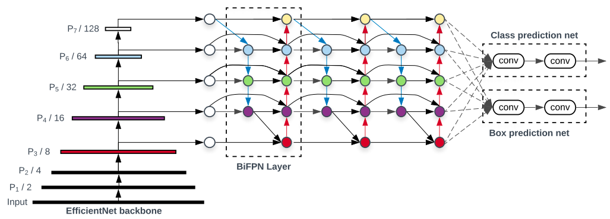

EfficientDet
============
|convnet-badge| |one-stage-det-badge| |objdet-badge|

.. toctree::
    :maxdepth: 1
    :hidden:

    efficientdet_d0.rst
    efficientdet_d1.rst
    efficientdet_d2.rst
    efficientdet_d3.rst
    efficientdet_d4.rst
    efficientdet_d5.rst
    efficientdet_d6.rst
    efficientdet_d7.rst

.. autoclass:: lucid.models.EfficientDet

The `EfficientDet` class implements a family of **Efficient Object Detection** models, 
based on the architecture proposed by Tan et al. (2020).

It combines EfficientNet backbones with **BiFPN (Bidirectional Feature Pyramid Networks)** 
for scalable and efficient multi-scale detection.

Class Signature
---------------

.. code-block:: python

    class EfficientDet(
        compound_coef: Literal[0, 1, 2, 3, 4, 5, 6, 7] = 0,
        num_anchors: int = 9,
        num_classes: int = 80,
    )

Parameters
----------

- **compound_coef** (*Literal[0-7]*):  
  Compound scaling coefficient controlling backbone depth, width, and input resolution.

- **num_anchors** (*int*):  
  Number of anchor boxes per feature level, typically `9`.

- **num_classes** (*int*):  
  Number of target object classes.

Backbone Network
----------------

The backbone network of EfficientDet, a truncated EfficientNet model can be accessed via
`.backbone` attribute of an instance of the class `EfficientDet`.

.. warning::

    EfficientNet backbone for EfficientDet model is **not** pre-trained by default.
    
    The user should pre-train the corresponding separate EfficientNet variant model
    for image classification task and then migrate the weights of **stage 1-7** to
    `EfficientDet.backbone.model`.

    Weight migration can be easily done with `state_dict` and `load_state_dict` methods.

    .. code-block:: python
        
        pretrained = efficientnet_b0(...)  # Pre-trained for Image Classification
        model = EfficientDet(...)

        # Migrate Weights Stage-by-Stage
        for i in range(7):
            # Save state-dict of individual pre-trained model stage
            st_dict = getattr(pretrained, f"stage{i + 1}").state_dict()

            # model.backbone.model is an nn.Sequential module with 7 stages
            model.backbone.model[i].load_state_dict(st_dict)

Input Format
------------

The model expects a 4D input tensor of shape:

.. code-block:: python

    (N, 3, H, W)

Where:

- `N` is the batch size,
- `3` represents the RGB image channels,
- `H`, `W` are the input height and width (variable depending on `compound_coef`).

Target Format
--------------

Targets should be provided as a **list of Tensors**, one per image:

.. code-block:: python

    targets = [Tensor_i of shape (Ni, 5)]

Where:

- `Ni` is the number of objects in the *i-th* image,
- each row of shape `(5,)` corresponds to `[x_min, y_min, x_max, y_max, class_id]`.

.. note::

    Bounding box coordinates are expected in **absolute pixel units**, not normalized.

Loss Computation
----------------

During training, the total loss combines **classification** and **box regression** terms:

.. math::

    \mathcal{L}_{total} = \mathcal{L}_{cls} + \mathcal{L}_{box}

Where:

- :math:`\mathcal{L}_{cls}` is the **Focal Loss** for classification,  
- :math:`\mathcal{L}_{box}` is the **Smooth L1** or **IoU-based** regression loss.

Focal Loss Explanation
----------------------

The **Focal Loss** addresses the issue of class imbalance by down-weighting easy examples 
and focusing training on hard, misclassified samples.

It is defined as:

.. math::

    \mathcal{L}_{\text{focal}}(p_t) = -\alpha_t (1 - p_t)^{\gamma} \log(p_t)

Where:

- :math:`p_t` is the predicted probability for the true class:
  
  .. math::

      p_t = 
      \begin{cases}
      p, & \text{if } y = 1 \\
      1 - p, & \text{otherwise}
      \end{cases}

- :math:`\alpha_t` is a weighting factor balancing positive and negative samples,
- :math:`\gamma` (the focusing parameter) controls how much the easy examples are down-weighted.

The gradient of the Focal Loss with respect to the input probability :math:`p` is:

.. math::

    \frac{\partial \mathcal{L}_{\text{focal}}}{\partial p} 
    = \alpha_t \gamma (1 - p_t)^{\gamma - 1} p_t \log(p_t) 
      - \alpha_t (1 - p_t)^{\gamma} \frac{1}{p_t}

As :math:`p_t \to 1`, the gradient approaches zero, reducing the contribution of 
well-classified examples and allowing the model to focus on harder ones.

.. tip::

    - Typical values: :math:`\alpha_t = 0.25`, :math:`\gamma = 2.0`.  
    - For detection, Focal Loss is applied to every anchor across all pyramid levels.

.. note::

    The **Focal Loss** was first introduced in *Lin et al., 2017 (RetinaNet)*, 
    and EfficientDet adopted it to stabilize classification across feature scales.

Methods
-------

.. automethod:: lucid.models.objdet.EfficientDet.forward
.. automethod:: lucid.models.objdet.EfficientDet.predict
.. automethod:: lucid.models.objdet.EfficientDet.get_loss

.. tip::

    EfficientDet uses **compound scaling** to balance model accuracy and efficiency:  
    larger `compound_coef` values correspond to deeper and wider networks 
    (D0-D7).

.. warning::

    The target list length **must match** the batch size, 
    and each Tensor inside should contain `[x_min, y_min, x_max, y_max, class_id]` 
    for all objects in that image.
