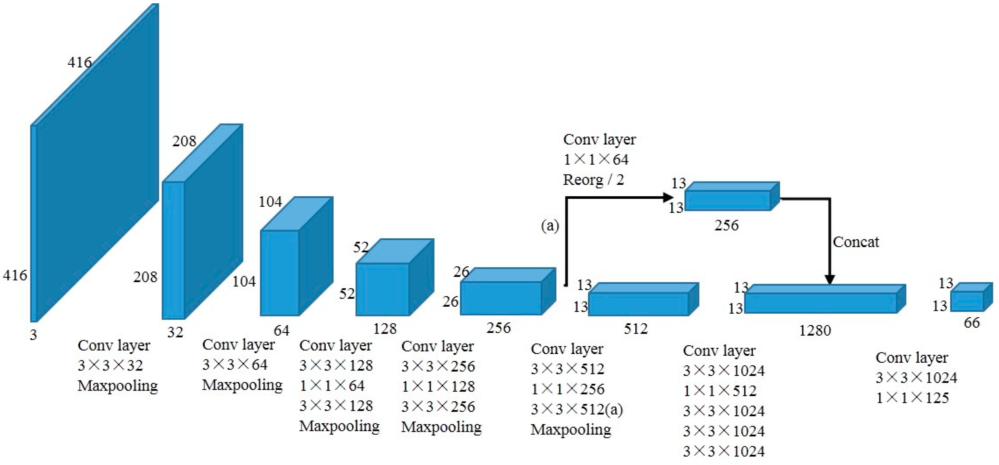

YOLO-v2
=======
|convnet-badge| |one-stage-det-badge| |objdet-badge|

.. toctree::
    :maxdepth: 1
    :hidden:

    yolo_v2.rst
    yolo_v2_tiny.rst

.. autoclass:: lucid.models.YOLO_V2

The `YOLO_V2` class implements the YOLO-v2 object detection model. 
It is an improvement over YOLO-v1, designed to detect objects in images using 
anchor-based bounding boxes, batch normalization, and a stronger backbone (Darknet-19).

Class Signature
---------------

.. code-block:: python

    class YOLO_V2(
        num_classes: int,
        num_anchors: int = 5,
        anchors: list[tuple[float, float]] | None = None,
        lambda_coord: float = 5.0,
        lambda_noobj: float = 0.5,
        darknet: nn.Module | None = None,
        route_layer: int | None = None,
        image_size: int = 416,
    )

Parameters
----------
- **darknet** (*nn.Module*, optional):
  A custom backbone model for feature extraction. If set to `None` (default), 
  the model uses the pre-configured Darknet-19 architecture.

Attributes
----------
- **darknet** (*nn.Module*):
  The feature extraction backbone model, either a custom model or Darknet-19. 
  If `None` is passed, Darknet-19 is used by default.

- **detect_head** (*nn.Module*):
  The detection head that processes the output from the backbone and generates 
  bounding boxes and class scores.

Methods
-------

.. automethod:: lucid.models.objdet.YOLO_V2.forward
.. automethod:: lucid.models.objdet.YOLO_V2.get_loss
.. automethod:: lucid.models.objdet.YOLO_V2.predict

Darknet-19 Integration
----------------------
The default backbone for the `YOLO_V2` class is **Darknet-19**, a convolutional neural network 
designed for efficient feature extraction. 

When `darknet=None` is passed during initialization, the model automatically uses the 
pre-defined Darknet-19 architecture.

To use the Darknet-19 network for object detection, the user must "pop" the network from 
the model to use it for training on the classification task. 

This can be done using `.darknet_19`:

.. code-block:: python
    
    yolo_v2_model = YOLO_V2()
    darknet_model = yolo_v2_model.darknet_19

After training on the classification task, the trained **darknet** 
can be automatically integrated back into the `YOLO_V2` model.

.. warning::

    If a custom backbone is provided (i.e., passing a custom `darknet` model during initialization), 
    the `darknet_19` attribute will raise an `AttributeError` because the custom backbone does 
    not have the full pre-built Darknet-19 structure.

Input Format
------------

The target tensor from the dataset should have shape:

.. code-block:: python

    (N, S, S, B * (5 + C))

Where:

- `S` is `split_size` (grid size),
- `B` is `num_anchors` (number of anchor boxes per grid cell),
- `C` is `num_classes`.

Each vector at `(i, j)` of shape `(B * (5 + C))` is flattened and contains:

- For each box `b = 0 .. B-1`: `(x, y, w, h, conf, cls_1, ..., cls_C)`

YOLO-v2 Loss
------------
The YOLO-v2 loss function builds upon YOLO-v1's multi-part loss and incorporates **anchor boxes**. 
For a grid of size :math:`S \times S` and :math:`B` anchors per grid cell, the predicted tensor 
shape becomes :math:`(S, S, B \times (5 + C))` where:

- 5 = [x, y, w, h, objectness]
- C = number of classes

The total loss :math:`\mathcal{L}` is composed of three parts:

.. math::

    \begin{aligned}
    \mathcal{L}
    &= \lambda_{\text{coord}}
       \sum_{i=1}^{S^2}\sum_{j=1}^{B}
       \mathbb{1}_{ij}^{\text{obj}} \,\alpha_{ij}
       \Big[
           (\sigma(\hat{t}_{x,ij}) - t_{x,ij})^2
         + (\sigma(\hat{t}_{y,ij}) - t_{y,ij})^2 \\\\
    &\quad+ (\hat{t}_{w,ij} - t_{w,ij})^2 + (\hat{t}_{h,ij} - t_{h,ij})^2 \Big] \\\\
    &+\sum_{i=1}^{S^2}\sum_{j=1}^{B}
       \Big[
           \mathbb{1}_{ij}^{\text{obj}}\,(\hat{C}_{ij}-1)^2
         + \lambda_{\text{noobj}}\,\mathbb{1}_{ij}^{\text{noobj}}\,(\hat{C}_{ij}-0)^2
       \Big] \\\\
    &+ \sum_{i=1}^{S^2}\sum_{j=1}^{B}
       \mathbb{1}_{ij}^{\text{obj}}
       \sum_{c=1}^{C}\big(\hat{p}_{ij}(c) - p_{ij}(c)\big)^2
    \end{aligned}

Where:

- :math:`\hat{t}_{x,ij}, \hat{t}_{y,ij}, \hat{t}_{w,ij}, \hat{t}_{h,ij}` are the 
  raw network outputs for the bounding box parameters
- :math:`t_{x,ij}, t_{y,ij}` are the target offsets of the box center relative 
  to the grid cell location
- :math:`t_{w,ij}, t_{h,ij}` are the target log-scale factors relative to the 
  anchor dimensions
- :math:`\hat{C}_{ij} = \sigma(\hat{t}_{o,ij})` is the predicted objectness score
- :math:`C_{ij}` is the target confidence (1 if the anchor is responsible for an 
  object, 0 otherwise; anchors with IoU above the ignore threshold are excluded)
- :math:`\hat{p}_{ij}(c)` are the predicted class probabilities (after sigmoid) 
  for class :math:`c`
- :math:`p_{ij}(c)` are the ground-truth class probabilities (one-hot encoding)
- :math:`\mathbb{1}_{ij}^{\text{obj}}` indicates if anchor :math:`j` in cell 
  :math:`i` is responsible for detecting an object
- :math:`\mathbb{1}_{ij}^{\text{noobj}} = 1 - \mathbb{1}_{ij}^{\text{obj}}` indicates
  that anchor :math:`j` in cell :math:`i` is not responsible for any object

.. note::

    Unlike YOLO-v1, YOLO-v2 uses **predefined anchors** and decouples object classification 
    and localization more clearly, improving detection stability and accuracy.

Prediction Output
-----------------

Calling `model.predict(...)` returns final post-processed detections after applying 
confidence thresholding and non-maximum suppression (NMS). 

The return value is a list of length `N` (batch size), where each element is a list 
of dictionaries representing the detected objects in that image. Each dictionary 
has the following keys:

- `"box"`: Tensor of shape `(4,)` representing the absolute coordinates 
  `[x1, y1, x2, y2]` of the bounding box in pixels

- `"score"`: Confidence score after multiplying objectness with class probability
- `"class_id"`: Predicted class index

Example Usage
-------------
.. admonition:: Using YOLO-V2 with default Darknet-19

    .. code-block:: python

        >>> import lucid
        >>> import lucid.models as models
        >>> model = models.YOLO_V2()  # Uses default Darknet-19 backbone
        >>> input_tensor = lucid.Tensor(..., requires_grad=False)
        >>> output = model(input_tensor)
        >>> print(output.shape)

.. admonition:: Using YOLO-V2 with a custom backbone

    .. code-block:: python

        >>> custom_darknet = ...  # Define or load your custom backbone
        >>> model = models.YOLO_V2(darknet=custom_darknet)
        >>> input_tensor = lucid.Tensor(..., requires_grad=False)
        >>> output = model(input_tensor)
        >>> print(output.shape)

Backward Propagation
--------------------
The YOLO-V2 model supports backpropagation through its network for training purposes. 
During backpropagation, gradients are computed and propagated through the darknet layers 
as well as the detection head:

.. code-block:: python

    >>> output.backward()
    >>> print(input_tensor.grad)  # Gradients w.r.t. the input tensor
