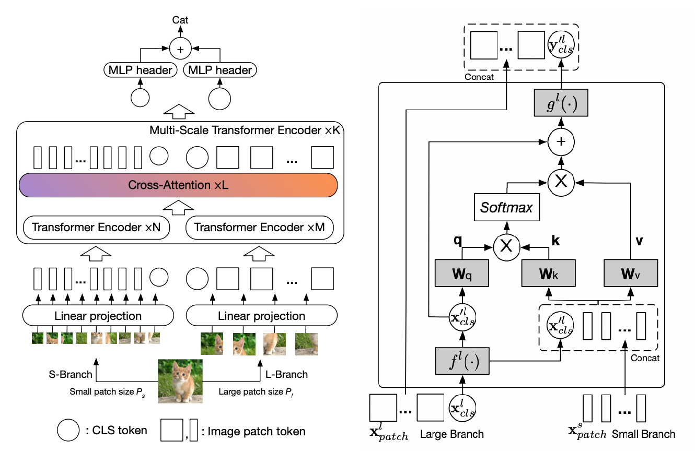

CrossViT
========

.. raw:: html

   
     Transformer
   
   
   
     Vision Transformer
   

   
     Image Classification
   

.. autoclass:: lucid.models.transformer.CrossViT

.. toctree::
    :maxdepth: 1
    :hidden:

    crossvit_tiny.rst
    crossvit_small.rst
    crossvit_base.rst
    crossvit_9.rst
    crossvit_15.rst
    crossvit_18.rst
    crossvit_9_dagger.rst
    crossvit_15_dagger.rst
    crossvit_18_dagger.rst

The `CrossViT` module implements the Cross-Attention Vision Transformer architecture, 
which combines multiple vision transformer branches with cross-attention mechanisms 
to effectively process multi-scale visual information.

Class Signature
---------------

.. code-block:: python

    class CrossViT(nn.Module):
        def __init__(
            self,
            img_size: int | list[int] = [224, 224],
            patch_size: list[int] = [12, 16],
            in_channels: int = 3,
            num_classes: int = 1000,
            embed_dim: list[int] = [192, 384],
            depth: list[list[int]] = [[1, 3, 1], [1, 3, 1], [1, 3, 1]],
            num_heads: list[int] = [6, 12],
            mlp_ratio: list[float] = [2.0, 2.0, 4.0],
            qkv_bias: bool = False,
            qk_scale: float | None = None,
            drop_rate: float = 0.0,
            attn_drop_rate: float = 0.0,
            drop_path_rate: float = 0.0,
            norm_layer: type[nn.Module] = nn.LayerNorm,
            multi_conv: bool = False,
        )

Parameters
----------

- **img_size** (*int | list[int]*, optional):
  Size of input image. Default is [224, 224].

- **patch_size** (*list[int]*, optional):
  Size of patch for each branch. Default is [12, 16].

- **in_channels** (*int*, optional):
  Number of input image channels. Default is 3.

- **num_classes** (*int*, optional):
  Number of classes for classification head. Default is 1000.

- **embed_dim** (*list[int]*, optional):
  Embedding dimension for each branch. Default is [192, 384].

- **depth** (*list[list[int]]*, optional):
  Depth of each stage for self-attention and cross-attention. 
  Default is [[1, 3, 1], [1, 3, 1], [1, 3, 1]].

- **num_heads** (*list[int]*, optional):
  Number of attention heads for each branch. Default is [6, 12].

- **mlp_ratio** (*list[float]*, optional):
  Ratio of MLP hidden dim to embedding dim for each stage. Default is [2.0, 2.0, 4.0].

- **qkv_bias** (*bool*, optional):
  If True, add a learnable bias to query, key, value projections. Default is False.

- **qk_scale** (*float | None*, optional):
  Override default qk scale of head_dim ** -0.5 if set. Default is None.

- **drop_rate** (*float*, optional):
  Dropout rate for embedding dropout. Default is 0.0.

- **attn_drop_rate** (*float*, optional):
  Dropout rate for attention dropout. Default is 0.0.

- **drop_path_rate** (*float*, optional):
  Stochastic depth rate. Default is 0.0.

- **norm_layer** (*type[nn.Module]*, optional):
  Normalization layer. Default is nn.LayerNorm.

- **multi_conv** (*bool*, optional):
  Whether to use multiple convolutional layers for patch embedding. Default is False.

Architecture
------------

The CrossViT architecture consists of:

1. **Multi-scale Patch Embedding**:
   - Different patch sizes (e.g., 12×12 and 16×16) to capture multi-scale features.
   - Each patch embedding branch forms a separate transformer processing path.

2. **Transformer Encoders**:
   - Self-attention transformers process each scale's embeddings independently.
   - Cross-attention exchanges information between different scales.
   - Multiple stages integrate self and cross-attention operations.

3. **Fusion Mechanism**:
   - Cross-attention modules aggregate information from different scales.
   - Weighted fusion combines outputs from multiple branches for final prediction.

4. **Classification Head**:
   - Final token classification through shared MLP layers.

Mathematical Representation
---------------------------

The core cross-attention operation can be represented as:

.. math::
    \text{Attention}(Q, K, V) = \text{softmax}\left(\frac{QK^T}{\sqrt{d_k}}\right)V

Where for cross-attention between scales:

.. math::
    Q_1 = W_Q^1 \cdot X_1, \quad K_2 = W_K^2 \cdot X_2, \quad V_2 = W_V^2 \cdot X_2

.. math::
    \text{CrossAttention}(X_1, X_2) = 
    \text{softmax}\left(\frac{Q_1 K_2^T}{\sqrt{d_k}}\right)V_2

Examples
--------

**Basic Usage**

.. code-block:: python

    import lucid
    from lucid.models.transformer import CrossViT

    # Create a default CrossViT model
    model = CrossViT()

    # Forward pass
    input_tensor = lucid.randn(1, 3, 224, 224)
    output = model(input_tensor)

    print(output.shape)  # Shape: (1, 1000)

**Custom Configuration**

.. code-block:: python

    # Create CrossViT with custom configuration
    model = CrossViT(
        img_size=[384, 384],
        patch_size=[16, 32],
        embed_dim=[256, 512],
        depth=[[1, 4, 1], [1, 4, 1], [1, 4, 1]],
        num_heads=[8, 16],
        num_classes=100
    )

    input_tensor = lucid.randn(1, 3, 384, 384)
    output = model(input_tensor)
    print(output.shape)  # Shape: (1, 100)

.. note::
   The number of branches in CrossViT is determined by the length of the 
   `patch_size` and `embed_dim` lists.

.. tip::
   Using different patch sizes allows the model to capture both fine-grained 
   details (smaller patches) and global semantic information (larger patches) 
   simultaneously.

.. warning::
   The length of `patch_size` and `embed_dim` must match, as they define the \
   parallel branches of the model.

Implementation Details
----------------------

The CrossViT implementation follows the approach described in the paper 
"CrossViT: Cross-Attention Multi-Scale Vision Transformer for Image Classification"
by Chen et al. It extends traditional Vision Transformers by:

1. Employing multiple transformer branches with different patch sizes to capture 
   multi-scale features.
2. Using cross-attention to exchange information between branches.
3. Maintaining computational efficiency through careful attention design.

The module is organized as:

- **Patch Embedding**: Converts image patches into embeddings for each branch.
- **Transformer Encoder Stages**: Processes embeddings through self and cross-attention.
- **Classification Head**: Aggregates information for final prediction.

This approach has shown to be effective for image classification tasks, particularly
when recognizing objects at different scales is important.