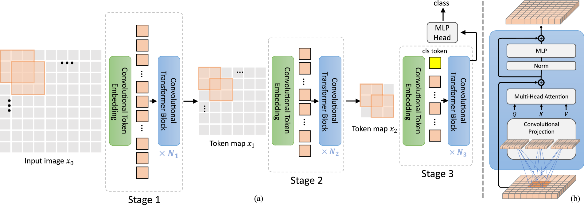

CvT
===

.. toctree::
    :maxdepth: 1
    :hidden:

    cvt_13.rst
    cvt_21.rst
    cvt_w24.rst

.. raw:: html

   
     Transformer
   
   
   
     Vision Transformer
   

   
     Image Classification
   

.. autoclass:: lucid.models.CvT

The `CvT` (Convolutional Vision Transformer) class implements a hybrid vision transformer
that integrates convolutional layers into the self-attention mechanism. Unlike traditional
Vision Transformers (ViTs), CvT introduces depthwise convolutional projections in the query,
key, and value transformations, which enhances inductive biases and improves efficiency.
This hybrid approach helps in capturing both local and global features effectively while
reducing computational cost.

Class Signature
---------------

.. code-block:: python

    class CvT(
        in_channels: int = 3,
        num_classes: int = 1000,
        act_layer: Type[nn.Module] = nn.GELU,
        norm_layer: Type[nn.Module] = nn.LayerNorm,
        spec: CvTSpec | None = None,
    )

Parameters
----------
- **in_channels** (*int*):
  Number of input channels (e.g., 3 for RGB images).

- **num_classes** (*int*):
  Number of output classes for classification.

- **act_layer** (*Type[nn.Module]*):
  Activation function used in the model (default is `nn.GELU`).

- **norm_layer** (*Type[nn.Module]*):
  Normalization layer to be used (default is `nn.LayerNorm`).

- **spec** (*CvTSpec | None*):
  Optional model specification defining the architecture details.

Examples
--------

.. code-block:: python

    >>> import lucid.models as models
    >>> cvt = models.CvT(
    ...     in_channels=3,
    ...     num_classes=1000,
    ... )

