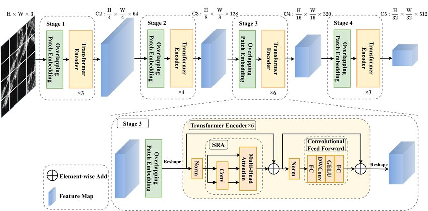

PVT_V2
======

.. toctree::
    :maxdepth: 1
    :hidden:

    pvt_v2_b0.rst
    pvt_v2_b1.rst
    pvt_v2_b2.rst
    pvt_v2_b2_li.rst
    pvt_v2_b3.rst
    pvt_v2_b4.rst
    pvt_v2_b5.rst

.. autoclass:: lucid.models.PVT_V2

The `PVT_V2` class implements the second version of the Pyramid Vision Transformer (PVT-v2),
a hierarchical transformer architecture enhanced for both computational efficiency and representational power
compared to its predecessor, `PVT`.

Key Enhancements
----------------

- **Linear Attention (Optional)**: 
  PVT-v2 introduces the option to use linear attention mechanisms, 
  which reduce complexity from quadratic to linear in spatial dimensions, 
  enabling faster inference on high-resolution inputs.

- **Deeper Spatial Reduction Control**: 
  The `sr_ratios` are retained from PVT but allow finer control per stage in PVT-v2, 
  improving feature extraction and efficiency during multi-stage attention.

Function Signature
------------------

.. code-block:: python

    class PVT_V2(nn.Module):
        def __init__(
            self,
            img_size: int = 224,
            patch_size: int = 7,
            in_channels: int = 3,
            num_classes: int = 1000,
            embed_dims: list[int] = [64, 128, 256, 512],
            num_heads: list[int] = [1, 2, 4, 8],
            mlp_ratios: list[int] = [4, 4, 4, 4],
            qkv_bias: bool = False,
            qk_scale: float | None = None,
            drop_rate: float = 0.0,
            attn_drop_rate: float = 0.0,
            drop_path_rate: float = 0.0,
            norm_layer: type[nn.Module] = nn.LayerNorm,
            depths: list[int] = [3, 4, 6, 3],
            sr_ratios: list[int] = [8, 4, 2, 1],
            num_stages: int = 4,
            linear: bool = False,
        ) -> None

Parameters
----------

- **img_size** (*int*, optional):  
  The input image size. Default is `224`.

- **patch_size** (*int*, optional):  
  The patch size for tokenization. Default is `7`.

- **in_channels** (*int*, optional):  
  Number of channels in input image. Default is `3`.

- **num_classes** (*int*, optional):  
  Number of classes for classification. Default is `1000`.

- **embed_dims** (*list[int]*, optional):  
  Embedding dimensions for each transformer stage. Default is `[64, 128, 256, 512]`.

- **num_heads** (*list[int]*, optional):  
  Number of attention heads in each stage. Default is `[1, 2, 4, 8]`.

- **mlp_ratios** (*list[int]*, optional):  
  MLP expansion ratios per stage. Default is `[4, 4, 4, 4]`.

- **qkv_bias** (*bool*, optional):  
  Whether to use bias in q/k/v projections. Default is `False`.

- **qk_scale** (*float | None*, optional):  
  Optional scaling for query-key dot product. Default is `None`.

- **drop_rate** (*float*, optional):  
  Dropout rate for MLP outputs. Default is `0.0`.

- **attn_drop_rate** (*float*, optional):  
  Dropout rate for attention weights. Default is `0.0`.

- **drop_path_rate** (*float*, optional):  
  Dropout rate for residual paths. Default is `0.0`.

- **norm_layer** (*type[nn.Module]*, optional):  
  Normalization layer to use. Default is `nn.LayerNorm`.

- **depths** (*list[int]*, optional):  
  Depth (number of blocks) at each stage. Default is `[3, 4, 6, 3]`.

- **sr_ratios** (*list[int]*, optional):  
  Spatial reduction ratios per stage. Default is `[8, 4, 2, 1]`.

- **num_stages** (*int*, optional):  
  Number of transformer stages. Default is `4`.

- **linear** (*bool*, optional):  
  Whether to use linear attention. Default is `False`.

Returns
-------
- **PVT_V2**:  
  An instance of the `PVT_V2` model for image tasks.
