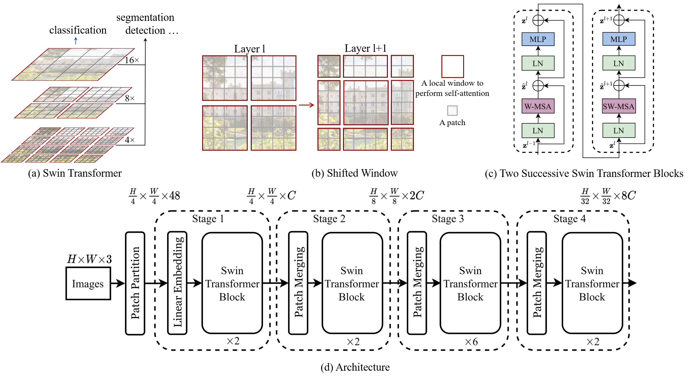

SwinTransformer
===============

.. toctree::
    :maxdepth: 1
    :hidden:

    swin_tiny.rst
    swin_small.rst
    swin_base.rst
    swin_large.rst

.. raw:: html

   
     Transformer
   
   
   
     Vision Transformer
   

   
     Image Classification
   

.. autoclass:: lucid.models.SwinTransformer

The `SwinTransformer` class implements a hierarchical vision transformer with shifted
windows, designed for image recognition and dense prediction tasks. Unlike the original
Vision Transformer (ViT), which processes fixed-size patches in a flat manner, the Swin
Transformer divides the image into patches, computes self-attention within local windows,
and then shifts these windows to enable cross-window interactions. This design improves
computational efficiency and allows the model to capture both local and global dependencies.

Class Signature
---------------

.. code-block:: python

    class SwinTransformer(
        img_size: int = 224,
        patch_size: int = 4,
        in_channels: int = 3,
        num_classes: int = 1000,
        embed_dim: int = 96,
        depths: list[int] = [2, 2, 6, 2],
        num_heads: list[int] = [3, 6, 12, 24],
        windows_size: int = 7,
        mlp_ratio: float = 4.0,
        qkv_bias: bool = True,
        qk_scale: float | None = None,
        drop_rate: float = 0.0,
        attn_drop_rate: float = 0.0,
        drop_path_rate: float = 0.1,
        norm_layer: Type[nn.Module] = nn.LayerNorm,
        abs_pos_emb: bool = False,
        patch_norm: bool = True,
    )

Parameters
----------
- **img_size** (*int*):
  Size of the input image (assumes square images).

- **patch_size** (*int*):
  Size of the patches the image is divided into.

- **in_channels** (*int*):
  Number of input channels (e.g., 3 for RGB images).

- **num_classes** (*int*):
  Number of output classes for classification.

- **embed_dim** (*int*):
  Dimension of the embedding for the first stage.

- **depths** (*list[int]*):
  A list specifying the number of transformer blocks in each stage.

- **num_heads** (*list[int]*):
  A list specifying the number of attention heads in each stage.

- **windows_size** (*int*):
  Size of the local window for self-attention.

- **mlp_ratio** (*float*):
  Ratio of the hidden dimension in the MLP relative to the embedding dimension.

- **qkv_bias** (*bool*):
  Whether to include a learnable bias in the query, key, and value projections.

- **qk_scale** (*float | None*):
  Override the default scaling for the query and key, if provided.

- **drop_rate** (*float*):
  Dropout probability applied throughout the model.

- **attn_drop_rate** (*float*):
  Dropout probability for the attention weights.

- **drop_path_rate** (*float*):
  Stochastic depth rate for regularization.

- **norm_layer** (*Type[nn.Module]*):
  Normalization layer to be used (default is `nn.LayerNorm`).

- **abs_pos_emb** (*bool*):
  Whether to use absolute positional embedding.

- **patch_norm** (*bool*):
  Whether to apply normalization after patch embedding.

Examples
--------

.. code-block:: python

    >>> import lucid.models as models
    >>> swin = models.SwinTransformer(
    ...     img_size=224,
    ...     patch_size=4,
    ...     in_channels=3,
    ...     num_classes=1000,
    ...     embed_dim=96,
    ...     depths=[2, 2, 6, 2],
    ...     num_heads=[3, 6, 12, 24],
    ... )
