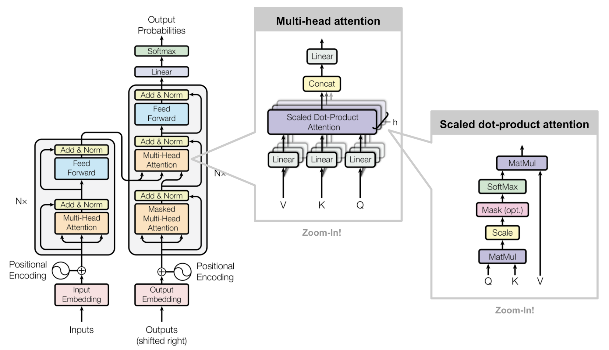

nn.Transformer
==============

.. autoclass:: lucid.nn.Transformer

Overview
--------
The `Transformer` module is a complete sequence-to-sequence transformer model 
consisting of an encoder and a decoder. It is commonly used in natural language 
processing tasks such as machine translation, text generation, and more. The model 
follows the standard transformer architecture introduced in 
*Attention Is All You Need* by Vaswani et al. (2017).

Class Signature
---------------
.. code-block:: python

    class lucid.nn.Transformer(
        d_model: int = 512,
        num_heads: int = 8,
        num_encoder_layers: int = 6,
        num_decoder_layers: int = 6,
        dim_feedforward: int = 2048,
        dropout: float = 0.1,
        activation: Callable[[Tensor], Tensor] = F.relu,
        layer_norm_eps: float = 1e-5,
        norm_first: bool = False,
        bias: bool = True,
        custom_encoder: nn.Module | None = None,
        custom_decoder: nn.Module | None = None,
    )

Parameters
----------
- **d_model** (*int*, default=512):
  The dimensionality of the input embeddings (:math:`d_{model}`).

- **num_heads** (*int*, default=8):
  The number of attention heads in each multi-head attention layer (:math:`H`).

  .. warning::

     The embedding dimension (:math:`d_{model}`) must be divisible by :math:`H`.

- **num_encoder_layers** (*int*, default=6):
  The number of `TransformerEncoderLayer` instances stacked in the encoder.

- **num_decoder_layers** (*int*, default=6):
  The number of `TransformerDecoderLayer` instances stacked in the decoder.

- **dim_feedforward** (*int*, default=2048):
  The dimensionality of the intermediate layer in the feedforward network.

- **dropout** (*float*, default=0.1):
  Dropout probability applied to the attention and feedforward layers.

- **activation** (*Callable[[Tensor], Tensor]*, default=F.relu):
  The activation function applied in the feedforward network.

- **layer_norm_eps** (*float*, default=1e-5):
  A small constant added to the denominator for numerical stability in layer normalization.

- **norm_first** (*bool*, default=False):
  If `True`, applies layer normalization before the attention and feedforward sublayers, 
  instead of after.

- **bias** (*bool*, default=True):
  If `True`, enables bias terms in the linear layers.

- **custom_encoder** (*nn.Module | None*, optional):
  If provided, replaces the default `TransformerEncoder` with a custom encoder.

- **custom_decoder** (*nn.Module | None*, optional):
  If provided, replaces the default `TransformerDecoder` with a custom decoder.

Forward Method
--------------

.. code-block:: python

    def forward(
        src: Tensor,
        tgt: Tensor,
        src_mask: Tensor | None = None,
        tgt_mask: Tensor | None = None,
        mem_mask: Tensor | None = None,
        src_key_padding_mask: Tensor | None = None,
        tgt_key_padding_mask: Tensor | None = None,
        mem_key_padding_mask: Tensor | None = None
    ) -> Tensor

Computes the forward pass of the Transformer model.

**Inputs:**

- **src** (*Tensor*):
  The source input tensor of shape :math:`(N, L_s, d_{model})`.

- **tgt** (*Tensor*):
  The target input tensor of shape :math:`(N, L_t, d_{model})`.

- **src_mask** (*Tensor | None*, optional):
  A mask of shape :math:`(L_s, L_s)` applied to the encoder self-attention weights.

- **tgt_mask** (*Tensor | None*, optional):
  A mask of shape :math:`(L_t, L_t)` applied to the decoder self-attention weights.

- **mem_mask** (*Tensor | None*, optional):
  A mask of shape :math:`(L_t, L_s)` applied to decoder-encoder cross-attention weights.

- **src_key_padding_mask** (*Tensor | None*, optional):
  A mask of shape :math:`(N, L_s)`, where non-zero values indicate positions that should be ignored in the encoder.

- **tgt_key_padding_mask** (*Tensor | None*, optional):
  A mask of shape :math:`(N, L_t)`, where non-zero values indicate positions that should be ignored in the decoder.

- **mem_key_padding_mask** (*Tensor | None*, optional):
  A mask of shape :math:`(N, L_s)`, where non-zero values indicate positions that should be ignored in cross-attention.

**Output:**

- **Tensor**: The output tensor of shape :math:`(N, L_t, d_{model})`.

Mathematical Details
--------------------
The Transformer model processes input through an encoder-decoder architecture as follows:

1. **Encoding Process**
   
   .. math::

       M = \operatorname{Encoder}(S)
   
   where :math:`S` is the source input and :math:`M` is the memory output of the encoder.

2. **Decoding Process**
   
   .. math::

       Y = \operatorname{Decoder}(T, M)
   
   where :math:`T` is the target input and :math:`Y` is the final output.

3. **Layer Normalization (if applied)**
   
   .. math::

       Y = \operatorname{LayerNorm}(Y)

Usage Example
-------------

.. code-block:: python

    import lucid
    import lucid.nn as nn

    # Create Transformer model
    transformer = nn.Transformer(
        d_model=512, num_heads=8, num_encoder_layers=6, num_decoder_layers=6
    )

    # Create random input tensors
    src = lucid.random.randn(16, 10, 512)  # (batch, seq_len, embed_dim)
    tgt = lucid.random.randn(16, 10, 512)
    
    # Compute Transformer output
    output = transformer(src, tgt)
    print(output.shape)  # Expected output: (16, 10, 512)

