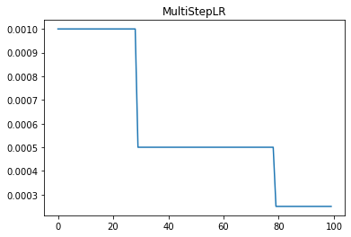

lr_scheduler.MultiStepLR
========================

.. autoclass:: lucid.optim.lr_scheduler.MultiStepLR

The `MultiStepLR` learning rate scheduler reduces the learning rate by a 
fixed factor (`gamma`) at specified milestone epochs. This is useful for 
cases where learning rate changes are required at specific training progress points.

Class Signature
---------------

.. code-block:: python

    class MultiStepLR(
        optimizer: Optimizer, 
        milestones: list[int], 
        gamma: float = 0.1, 
        last_epoch: int = -1, 
        verbose: bool = False
    )

Parameters
----------
- **optimizer** (*Optimizer*):
  The optimizer whose learning rate needs to be scheduled.
- **milestones** (*list[int]*):
  List of epoch indices where the learning rate should be reduced.
- **gamma** (*float*, optional):
  The factor by which the learning rate is multiplied at each milestone. Default: `0.1`.
- **last_epoch** (*int*, optional):
  The index of the last epoch when resuming training. Default: `-1`.
- **verbose** (*bool*, optional):
  If `True`, logs learning rate updates at each step. Default: `False`.

Mathematical Formula
--------------------
The learning rate at epoch :math:`t` is computed as:

.. math::

    \eta_t = \eta_0 \cdot \gamma^{\sum_{m \leq t} 1}

Where:
- :math:`\eta_t` is the learning rate at epoch :math:`t`.
- :math:`\eta_0` is the initial learning rate.
- :math:`\gamma` is the decay factor.
- The summation counts the number of milestones reached by epoch :math:`t`.

Methods
-------
- **get_lr() -> list[float]**:
  Computes the updated learning rate(s) based on milestone steps.

- **step(epoch: Optional[int] = None) -> None**:
  Updates the learning rate based on the current epoch.

Usage Example
-------------

.. code-block:: python

    import lucid.optim as optim
    from lucid.optim.lr_scheduler import MultiStepLR

    optimizer = optim.SGD(model.parameters(), lr=0.1)
    scheduler = MultiStepLR(optimizer, milestones=[10, 20, 30], gamma=0.5)
    
    for epoch in range(40):
        optimizer.step()
        scheduler.step()
        print(f"Epoch {epoch+1}, Learning Rate: {scheduler.last_lr}")

.. note::

    `MultiStepLR` is useful when learning rate adjustments are needed at specific 
    training milestones rather than at regular intervals.