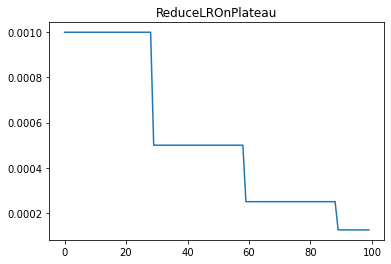

lr_scheduler.ReduceLROnPlateau
==============================

.. autoclass:: lucid.optim.lr_scheduler.ReduceLROnPlateau

The `ReduceLROnPlateau` learning rate scheduler adjusts the learning rate 
based on validation performance. If the monitored metric does not improve 
for a certain number of epochs (`patience`), the learning rate is reduced 
by a factor (`factor`). This helps in dynamically adapting the learning 
rate during training.

Class Signature
---------------

.. code-block:: python

    class ReduceLROnPlateau(
        optimizer: Optimizer, 
        mode: str = "min", 
        factor: float = 0.1, 
        patience: int = 10, 
        threshold: float = 1e-4, 
        threshold_mode: str = "rel", 
        cooldown: int = 0, 
        min_lr: float = 0, 
        eps: float = 1e-8, 
        verbose: bool = False
    )

Parameters
----------
- **optimizer** (*Optimizer*):
  The optimizer whose learning rate needs to be scheduled.
- **mode** (*str*, optional):
  "min" reduces LR when the monitored metric stops decreasing, 
  "max" reduces LR when it stops increasing. Default: "min".
- **factor** (*float*, optional):
  Multiplicative factor to reduce LR by. Default: `0.1`.
- **patience** (*int*, optional):
  Number of epochs with no improvement before reducing LR. Default: `10`.
- **threshold** (*float*, optional):
  Minimum improvement to qualify as a better metric. Default: `1e-4`.
- **threshold_mode** (*str*, optional):
  "rel" means relative improvement, "abs" means absolute improvement. Default: "rel".
- **cooldown** (*int*, optional):
  Number of epochs to wait after LR reduction before resuming monitoring. Default: `0`.
- **min_lr** (*float*, optional):
  Minimum LR value allowed. Default: `0`.
- **eps** (*float*, optional):
  Minimum difference between old and new LR for update. Default: `1e-8`.
- **verbose** (*bool*, optional):
  If `True`, logs LR updates. Default: `False`.

Mathematical Formula
--------------------
At epoch :math:`t`, if no improvement is detected beyond `patience`, 
the LR is updated as:

.. math::

    \eta_t = \max(\eta_{t-1} \times \text{factor}, \text{min_lr})

Where:
- :math:`\eta_t` is the learning rate at epoch :math:`t`.
- :math:`\text{factor}` is the decay multiplier.
- :math:`\text{min_lr}` is the minimum allowable LR.

Methods
-------
- **get_lr() -> list[float]**:
  Returns the current learning rate(s).

- **step(metrics: float, epoch: Optional[int] = None) -> None**:
  Adjusts the learning rate based on monitored metric.

Usage Example
-------------

.. code-block:: python

    import lucid.optim as optim
    from lucid.optim.lr_scheduler import ReduceLROnPlateau

    optimizer = optim.SGD(model.parameters(), lr=0.1)
    scheduler = ReduceLROnPlateau(optimizer, mode='min', factor=0.5, patience=5)
    
    for epoch in range(30):
        val_loss = evaluate_model()
        optimizer.step()
        scheduler.step(val_loss)
        print(f"Epoch {epoch+1}, Learning Rate: {scheduler.last_lr}")

.. note::

    `ReduceLROnPlateau` is effective for reducing the learning rate dynamically 
    when training stalls, improving model convergence.
