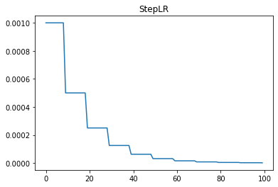

lr_scheduler.StepLR
===================

.. autoclass:: lucid.optim.lr_scheduler.StepLR

The `StepLR` learning rate scheduler reduces the learning rate by a fixed factor 
(`gamma`) every `step_size` epochs. This is useful for training scenarios where 
learning rate adjustments at regular intervals help in better convergence.

Class Signature
---------------

.. code-block:: python

    class StepLR(
        optimizer: Optimizer, 
        step_size: int, 
        gamma: float = 0.1, 
        last_epoch: int = -1, 
        verbose: bool = False
    )

Parameters
----------
- **optimizer** (*Optimizer*):
  The optimizer whose learning rate needs to be scheduled.
- **step_size** (*int*):
  Number of epochs between learning rate reductions.
- **gamma** (*float*, optional):
  The factor by which the learning rate is multiplied every `step_size` epochs. 
  Default: `0.1`.
- **last_epoch** (*int*, optional):
  The index of the last epoch when resuming training. Default: `-1`.
- **verbose** (*bool*, optional):
  If `True`, logs learning rate updates at each step. Default: `False`.

Mathematical Formula
--------------------
The learning rate at epoch :math:`t` is computed as:

.. math::

    \eta_t = \eta_0 \cdot \gamma^{\lfloor t / \text{step_size} \rfloor}

Where:
- :math:`\eta_t` is the learning rate at epoch :math:`t`.
- :math:`\eta_0` is the initial learning rate.
- :math:`\gamma` is the decay factor.
- :math:`\lfloor \cdot \rfloor` represents the floor function.

Methods
-------
- **get_lr() -> list[float]**:
  Computes the updated learning rate(s) based on step decay.

- **step(epoch: Optional[int] = None) -> None**:
  Updates the learning rate based on the current epoch.

Usage Example
-------------

.. code-block:: python

    import lucid.optim as optim
    from lucid.optim.lr_scheduler import StepLR

    optimizer = optim.SGD(model.parameters(), lr=0.1)
    scheduler = StepLR(optimizer, step_size=5, gamma=0.5)
    
    for epoch in range(20):
        optimizer.step()
        scheduler.step()
        print(f"Epoch {epoch+1}, Learning Rate: {scheduler.last_lr}")

.. note::

    `StepLR` is useful when a constant learning rate decay at fixed intervals 
    is preferred over continuous decay.
